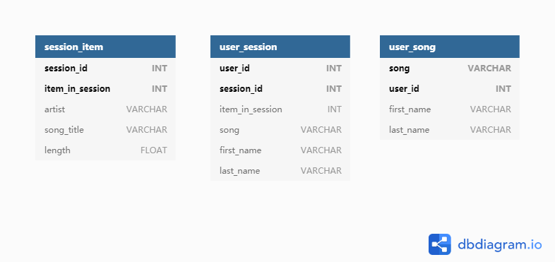

# Data-Modeling-with-Cassandra

This project consists of an ETL pipeline created using Python and data modeling with Apache Cassandra. The objective of this project is to create an Apache Cassandra database which can create queries on song play data for data analysis.

## Getting Started

A startup called Sparkify wants to analyze the data they've been collecting on songs and user activity on their new music streaming app. The analysis team is particularly interested in understanding what songs users are listening to. Currently, there is no easy way to query the data to generate the results, since the data reside in a directory of CSV files on user activity on the app.

### Dataset

The original data in `event_data` are in CSV form. The dataset are partitioned by day:

```shell
2018-11-01-events.csv
2018-11-02-events.csv
...
```

For each CSV file, the data looks like

```python
{
    'artist':'Mr Oizo',
    'auth':'Logged In',
    'firstName':'Kaylee',
    'gender':'F',
    'itemInSession':3,
    'lastName':'Summers',
    'length':144.03873,
    'level':'free',
    'location':'Phoenix-Mesa-Scottsdale, AZ',
    'method':'PUT',
    'page':'NextSong',
    'registration':1540340000000,
    'sessionId'139:,
    'song':'Flat 55',
    'status':200,
    'ts':1541110000000,
    'userId':8
}
```

### Prerequisites

```shell
Apache Cassandra
numpy
pandas
```

### ETL pipeline

In our data analysis, we are only interested in certain columns of the data. In our ETL pipeline, we first read all the CSV files. Then we merge them together to obtain the full event data CSV file. The columns we are going to use include

- artist
- firstName of user
- gender of user
- item number in session
- last name of user
- length of the song
- level (paid or free song)
- location of the user
- sessionId
- song title
- userId

Run PartI in `Project_1B.ipynb` to obtain the full data CSV file. The result will be saved in `event_datafile_new.csv`.

The denormalized data should be like


### Data modeling

We are using Apache Cassendra database to deal with the data. We are going to deal with the following three questions:

1. Give me the artist, song title and song's length in the music app history that was heard during  sessionId = 338, and itemInSession = 4
2. Give me only the following: name of artist, song (sorted by itemInSession) and user (first and last name) for userid = 10, sessionid = 182
3. Give me every user name (first and last) in my music app history who listened to the song 'All Hands Against His Own'

Hence, we will create three tables separately as follow:



```sql
-- Partition key: (session_id, item_in_session)
CREATE TABLE session_item 
(
    session_id INT,
    item_in_session INT,
    artist VARCHAR,
    song_title VARCHAR,
    length FLOAT,
    PRIMARY KEY(session_id, item_in_session)
);

-- Partition key: (user_id, session_id)
-- Clustering column: item_in_session
CREATE TABLE user_session
(
    user_id INT,
    session_id INT,
    item_in_session INT,
    song VARCHAR,
    first_name VARCHAR,
    last_name VARCHAR,
    PRIMARY KEY((user_id, session_id), item_in_session)
);

-- Partition key: (song_title, user_id)
CREATE TABLE user_song
(
    first_name VARCHAR,
    last_name VARCHAR,
    song VARCHAR,
    user_id INT,
    PRIMARY KEY(song, user_id)
);
```

## Running the queries

For the example, see `Project_1B.ipynb`.

### Query 1

We have created the `session_item` table to answer the question:

```sql
SELECT * FROM session_item WHERE session_id = 338 AND item_in_session = 4
```

### Query 2

We have created the `user_session` table to answer the question:

```sql
SELECT * FROM user_session WHERE user_id = 10 AND session_id = 182
```

### Query 3

We have created the `user_song` table to answer the question:

```sql
SELECT * FROM user_song WHERE song = 'All Hands Against His Own'
```

## License

This project is licensed under the MIT License.
